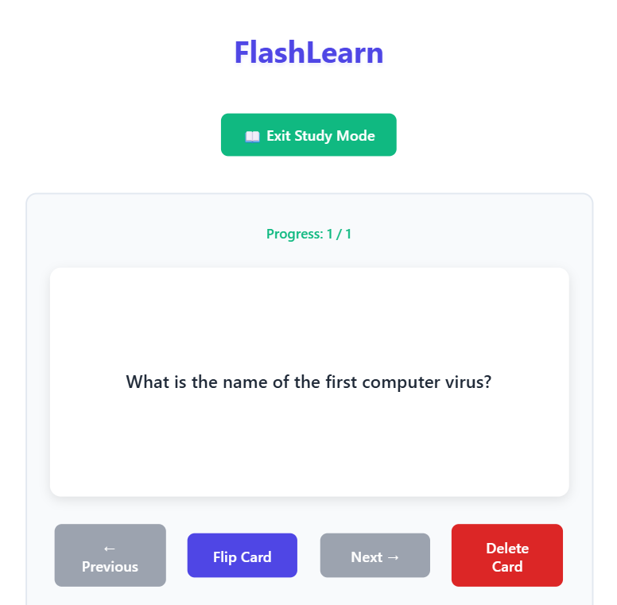

# 🚀 FlashLearn GitHub Upload Guide

## 📸 Step 1: Take Screenshots

### Create Screenshots Folder
```bash
mkdir screenshots
```

### Required Screenshots
Take these 3 screenshots and save them as:

1. **`screenshots/main-interface.png`**
   - Show the main interface with:
   - Deck selector dropdown
   - Add flashcard form
   - A sample flashcard displayed
   - Navigation buttons visible

2. **`screenshots/study-mode.png`**
   - Click "🎯 Start Study Mode"
   - Show the clean study interface
   - Progress indicator visible
   - Make sure it looks focused/distraction-free

3. **`screenshots/mobile-view.png`**
   - Use browser dev tools (F12)
   - Set to mobile view (iPhone/Android size)
   - Take screenshot showing responsive layout
   - Buttons should stack vertically

### Screenshot Tips
- Use sample cards with realistic content (e.g., "What is the capital of France?" / "Paris")
- Make sure UI looks clean and professional
- Avoid any placeholder text like "Lorem ipsum"
- Good lighting and clear text

## 📝 Step 2: Add Screenshots to Markdown

The README.md already has the correct syntax:

```markdown
## Screenshots

### Main Interface

*The main flashcard interface with deck selection and card management*

### Study Mode

*Focused study mode with progress tracking and minimal distractions*

### Mobile View

*Responsive design works great on mobile devices*
```

### Markdown Image Syntax Explained
```markdown

*Optional caption in italics*
```

- **Alt Text**: Describes image for accessibility
- **Path**: Relative path from README.md location
- **Caption**: Optional descriptive text below image

## 🗂️ Step 3: Final File Structure

Your repository should contain:
```
FlashLearn/
├── index.html
├── styles.css
├── script.js
├── README.md
├── learning_notes.md
└── screenshots/
    ├── main-interface.png
    ├── study-mode.png
    └── mobile-view.png
```

### ❌ Files to NOT Upload
- `setup-git-history.sh` ❌
- `setup-git-history.ps1` ❌
- `modern-flashcard-website.html` ❌
- Any `.gitignore` files (not needed for this project)
- Node modules or build folders (we don't have any)

## 🚀 Step 4: GitHub Upload Process

### Option A: GitHub Web Interface (Easiest)
1. Go to https://github.com/new
2. Repository name: `FlashLearn` or `flashcard-study-app`
3. Description: `A responsive flashcard application built with vanilla JavaScript for effective studying and memorization`
4. Make it **Public** (for portfolio visibility)
5. Don't initialize with README (we have our own)
6. Click "Create repository"

### Upload Files via Web:
1. Click "uploading an existing file"
2. Drag and drop all your files
3. Commit message: `Initial upload of FlashLearn project`
4. Click "Commit new files"

### Option B: Git Command Line
```bash
# Make sure you're in your project directory
cd C:\Users\hites\Study\FlashLearn

# Add screenshots
git add screenshots/
git commit -m "add project screenshots"

# Create GitHub repo first (via web interface), then:
git remote add origin https://github.com/yourusername/FlashLearn.git
git branch -M main
git push -u origin main
```

## ✨ Step 5: Repository Settings

### After Upload:
1. **Enable GitHub Pages** (if you want live demo):
   - Go to Settings > Pages
   - Source: Deploy from branch
   - Branch: main / (root)
   - Your app will be live at: `https://yourusername.github.io/FlashLearn`

2. **Add Topics/Tags**:
   - Click gear icon next to "About"
   - Add topics: `javascript`, `html-css`, `flashcards`, `study-tool`, `vanilla-js`, `responsive-design`

3. **Repository Description**:
   ```
   A responsive flashcard application built with vanilla JavaScript for effective studying and memorization. Features deck organization, study modes, and keyboard shortcuts.
   ```

## 📋 Step 6: Portfolio Presentation

### For Resume/CV:
**FlashLearn** - Flashcard Study Application
- **Tech Stack**: Vanilla JavaScript, CSS3, HTML5, localStorage API
- **Features**: Deck organization, study modes, responsive design, keyboard navigation
- **Live Demo**: https://yourusername.github.io/FlashLearn
- **Repository**: https://github.com/yourusername/FlashLearn

### For Job Applications:
"Built a progressive web application for flashcard-based studying, implementing localStorage persistence, responsive design, and an intuitive study mode interface. Developed over 3 months starting as coursework and evolving into a full-featured tool demonstrating vanilla JavaScript proficiency and user-centered design principles."

## 🎯 Final Checklist

Before uploading, verify:
- ✅ Screenshots are clear and professional
- ✅ README.md has working screenshot links
- ✅ All code files present and working
- ✅ No AI-revealing setup scripts included
- ✅ Git history looks natural and progressive
- ✅ learning_notes.md shows authentic development journey
- ✅ Repository name is professional
- ✅ Description explains the project clearly

## 🔧 Troubleshooting

### Screenshots Not Showing?
- Check file paths are correct (case-sensitive on some systems)
- Ensure screenshots are in `screenshots/` folder
- File names must match exactly: `main-interface.png`, `study-mode.png`, `mobile-view.png`

### Git Issues?
- Make sure you're in the right directory
- Check git remote with: `git remote -v`
- Force push if needed: `git push -f origin main`

### Live Demo Not Working?
- GitHub Pages takes 5-10 minutes to deploy
- Check GitHub Pages settings in repository
- Make sure `index.html` is in root directory

---

🎉 **You're ready to showcase FlashLearn as a professional portfolio project!**
