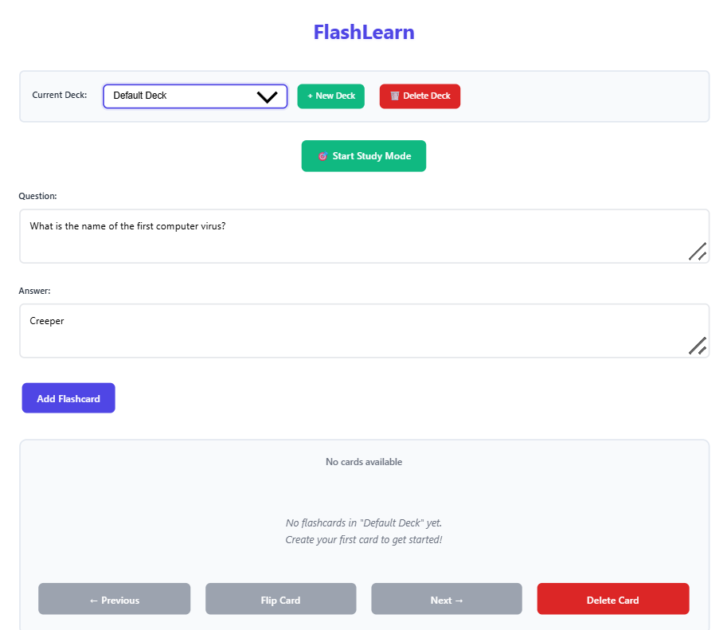
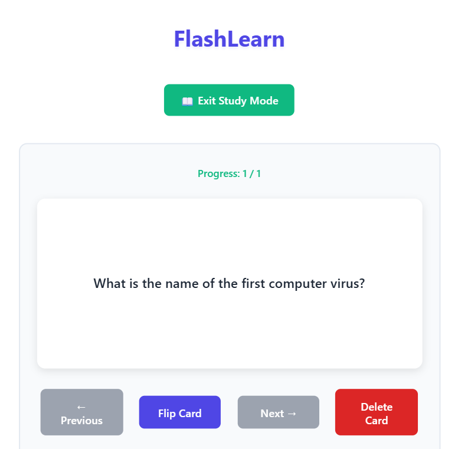
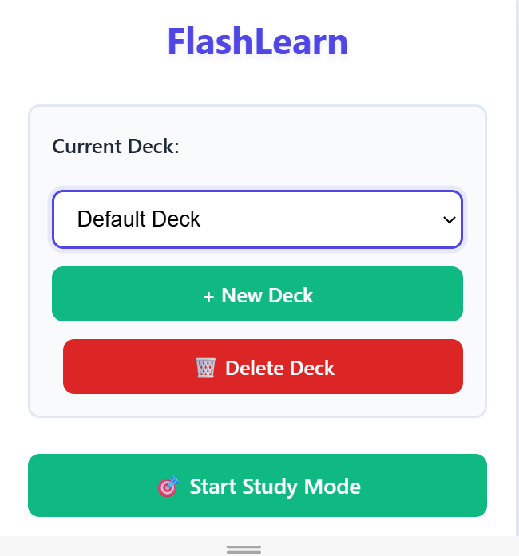

# FlashLearn

A simple, lightweight flashcard application for studying and memorization with deck organization and study modes.

## 🚀 Live Demo

**Try the app live**: [https://hitsisonline.github.io/FlashLearn/](https://hitsisonline.github.io/FlashLearn/)

## Overview

FlashLearn is a minimal web-based flashcard app built as an academic prototype in October 2024, then progressively enhanced through December 2024. **Prototype built Oct 2024 during coursework; enhancements Nov–Dec 2024 while learning Git and best practices.** It allows users to create, organize, and review flashcards for effective learning across multiple subjects.

## Features

- **Add Flashcards**: Create question-answer pairs with a simple form
- **Deck Organization**: Organize cards into subject-specific decks (Math, History, etc.)
- **Study Mode**: Focused review interface with progress tracking
- **Card Navigation**: Browse through cards with Previous/Next buttons
- **Flip Functionality**: Click to reveal answers, promoting active recall
- **Keyboard Shortcuts**: Space (flip), arrows (navigate), Shift+S (study mode)
- **Delete Cards**: Remove unwanted flashcards
- **Persistent Storage**: Cards and decks automatically saved to browser storage
- **Responsive Design**: Works on desktop and mobile devices
- **Clean UI**: Minimalist interface focused on learning

## Usage

1. Open `index.html` in any modern web browser
2. **Create Decks**: Use the "New Deck" button to organize cards by subject
3. **Delete Decks**: Use the "🗑️ Delete Deck" button (⚠️ This deletes the deck AND all its cards!)
4. **Add Cards**: Fill in the question and answer fields, click "Add Flashcard"
4. **Study Mode**: Click "🎯 Start Study Mode" for focused review sessions
5. **Navigate**: Use Previous/Next buttons or arrow keys to browse cards
6. **Flip Cards**: Click the card or press Space to reveal answers
7. **Keyboard Shortcuts**:
   - **Space**: Flip current card
   - **← →**: Navigate between cards  
   - **Shift+S**: Toggle study mode
   - **Esc**: Exit study mode

## Screenshots

### Main Interface

### Study Mode

### Mobile View

## Technical Details

- **HTML/CSS/JavaScript**: No frameworks or dependencies
- **Modular Architecture**: Separated CSS, JS, and HTML files
- **localStorage Persistence**: Cards and decks automatically saved and restored
- **Deck System**: Organize flashcards by subject with real-time filtering
- **Study Mode**: Distraction-free interface with progress tracking  
- **Responsive**: Uses Flexbox for mobile-friendly layout
- **Keyboard Navigation**: Full keyboard support for efficient studying

## Academic Context

**Academic submission October 2024** - Created as a coursework prototype to demonstrate fundamental web development concepts including DOM manipulation, event handling, and responsive design. Progressively enhanced through November-December 2024 while learning Git workflows and software development best practices.

## Development Timeline

Started this as a class project in October 2024, then kept improving it:
- **Oct 2024**: Initial prototype for web dev coursework
- **Nov 2024**: Added persistence and study features during semester break
- **Dec 2024**: Final touches while learning more CSS/JS patterns
- **Dec 2024**: Added deck deletion after realizing I needed it while using the app

## What I Learned
Building this taught me vanilla JavaScript fundamentals, localStorage APIs, and responsive design. The biggest challenge was figuring out the deck filtering logic - took me way longer than expected! Also learned the importance of actually using your own software - that's how I discovered I needed deck deletion.

## Known Issues & Notes
- **Deck Deletion**: ⚠️ Deleting a deck permanently removes ALL cards in that deck - no undo!
- **Default Deck**: The "Default Deck" cannot be deleted (it's needed for the app to work)
- **Storage Limit**: Browser localStorage has size limits (~5-10MB typically)
- No search or filtering capabilities yet
- Limited to single browser/device (no cloud sync)

## Future Enhancements

- Search and filtering for large card collections
- Spaced repetition algorithm for better memory retention
- Import/export functionality for sharing decks
- Cloud sync for cross-device access
- Study statistics and progress analytics

## How to Run

Simply open `index.html` in any modern web browser - no build tools or server required! Works completely offline once loaded.

